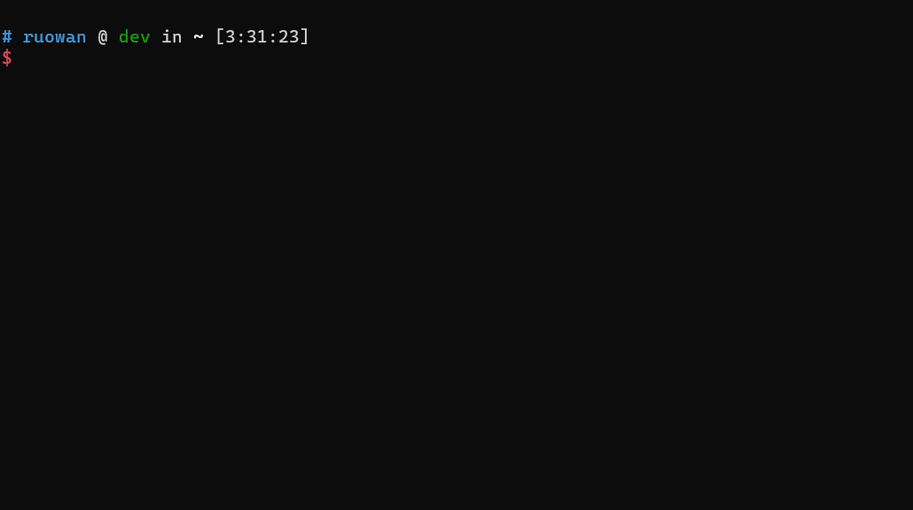

# Generate a basic test scenario file

## Prerequisite

We use `oav` tools to generate basic test scenario. `oav` analyze swagger file and use swagger example as test scenario steps.

## Introduction

`oav` support rule based test scenario file generation. We use this command to generate test scenario file.

`oav generate-static-test-scenario --readme <readme> --tag <tag> --rules <generated-rules>`

- readme: swagger readme file.
- tag: which tag to generate. oav will analyze swagger file under the tag and generate test scenario.

Example:



This command will load and analyze swagger and generate a basic test scenario file.

Result: the output contains two files

- test-scenarios/signalR.yaml: The test scenario file.
- readme.test.md: The entry for SDK test generation

The generated test scenario file: The generated test scenario file contains two steps. Create signalR and delete it. It's a basic test scenario and developer can add more step based on the basic test scenario file.

```
scope: ResourceGroup
testScenarios:
  - description: Microsoft.SignalRService/signalR SignalR_CreateOrUpdate
    steps:
      - step: SignalR_CreateOrUpdate
        exampleFile: ../examples/SignalR_CreateOrUpdate.json
      - step: SignalR_Delete
        exampleFile: ../examples/SignalR_Delete.json
```

## Reference

- [oav](https://github.com/Azure/oav/tree/develop)
